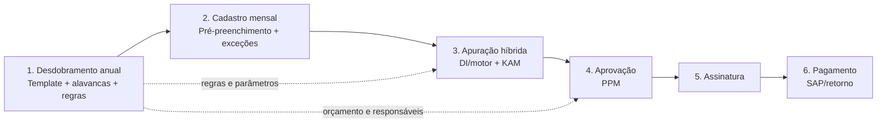
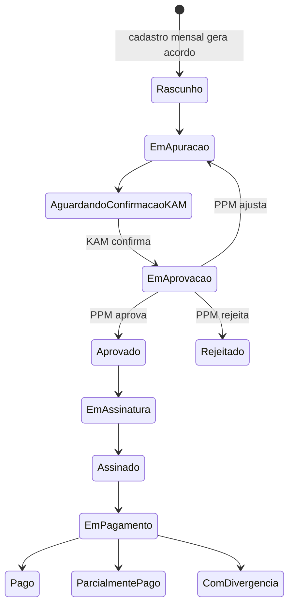

# Agreements Futuro — Arquitetura funcional corrigida

## Decisão estrutural

**Desdobramento e Cadastro não são redundantes.** O Desdobramento é anual, define a estrutura que governa o ciclo e não cria acordos mensais. O Cadastro é mensal, consome essa estrutura para conferência do KAM e gera os acordos daquele mês.

## Mapa funcional

| Etapa | Cadência e objetivo | Proprietário primário | Componente central |
| --- | --- | --- | --- |
| 1. Desdobramento anual | Anual. Carregar e homologar a matriz de alavancas que orienta os meses seguintes. | Administrador/KAM responsável pelo planejamento | `BulkUpload`, `UploadTemplateCard`, `LeversTable` |
| 2. Cadastro mensal | Mensal. Conferir a cópia pré-preenchida, tratar somente exceções e gerar acordos. | KAM | `MonthlyCheckTable`, `ExceptionDrawer`, `ConfirmOkAction` |
| 3. Apuração híbrida | Mensal. Consolidar valores automáticos e manuais; confirmar que o resultado está correto. | Motor externo/DI e KAM | `AgreementTable`, `ManualInputCell`, `LeverAutomationBadge` |
| 4. Aprovação | Mensal. Decidir sobre os acordos confirmados, preservando a mesma leitura da tabela. | PPM | `AgreementTable`, `ApprovalBatchActions`, `ValueComparison` |
| 5. Assinatura | Por acordo aprovado. Coletar e rastrear formalização. | KAM/partes signatárias | `StatusIndicator`, `AuditTrail`, `FileUpload` |
| 6. Pagamento | Por acordo assinado. Solicitar, acompanhar retorno e conciliar pagamento. | Financeiro/SAP | `PaymentStatusTimeline`, `SAPReturnStatus`, `BudgetConsumptionCard` |

## Fluxo ponta a ponta

1. O usuário baixa o template anual, preenche alavancas, metas, compradores, responsáveis, orçamento, parâmetros de cálculo, eficiência e tipo de apuração.
2. O upload valida o template, aponta linhas inválidas e publica uma versão anual. Essa versão é a fonte das regras mensais.
3. Na abertura do mês, o sistema instancia o cadastro mensal a partir da versão anual vigente e do período. Ele pré-preenche todos os dados disponíveis.
4. O KAM apenas confirma, complementa dados ausentes ou altera exceções com motivo e trilha de auditoria. Ao concluir, gera os acordos mensais.
5. O motor/DI atualiza automaticamente alavancas automáticas. O KAM informa valores para as manuais e complementa as híbridas quando necessário.
6. O KAM confirma o valor apurado de cada acordo. Apenas acordos apurados e confirmados entram na fila do PPM.
7. O PPM vê a mesma estrutura de tabela, comparando valor orçado, apurado e aprovado/pago. Pode aprovar, rejeitar ou ajustar — ajuste retorna o item à etapa adequada, sempre com motivo.
8. Acordos aprovados seguem para assinatura; acordos assinados são enviados ao pagamento e acompanham o retorno SAP até a conciliação.

## Entradas e saídas por etapa

| Etapa | Entradas | Processamento e regras | Saídas / condição de passagem |
| --- | --- | --- | --- |
| Desdobramento anual | Template, ano, alavancas, metas, compradores, responsáveis, orçamento, cálculo, eficiência e tipo de apuração | Validação de colunas, chaves, tipos, duplicidade, soma de orçamento e regras obrigatórias; versionamento | `AnnualPlanVersion` publicada; matriz anual de alavancas ativa para o período |
| Cadastro mensal | Versão anual ativa, competência, calendário e dados complementares disponíveis | Pré-preenchimento; alteração limitada a exceção; campos ausentes obrigam complemento; registro de justificativa | `MonthlyRegistration` validado e `Agreement` gerado como rascunho/pronto para apuração |
| Apuração híbrida | Acordo mensal, regras de cálculo, retorno DI/motor, valores manuais do KAM | Cálculo por tipo automático/manual/híbrido; conciliação de fontes; validação de faixa; confirmação explícita do KAM | `Measurement` apurada e confirmada; acordo elegível para aprovação |
| Aprovação | Acordos confirmados, comparativos orçado/apurado, histórico e anexos | PPM aprova, rejeita ou ajusta; ações em lote respeitam permissões e bloqueios | `ApprovalDecision`; aprovado segue para assinatura, rejeitado/ajustado retorna com motivo |
| Assinatura | Acordo aprovado, partes, documento e metadados | Envio/coleta e registro dos eventos de assinatura | `SignatureRecord` concluído; acordo elegível para pagamento |
| Pagamento | Acordo assinado, valor aprovado e dados financeiros/SAP | Solicitação, retorno SAP, conciliação e tratamento de falhas | `Payment` pago/parcialmente pago/com divergência; orçamento consumido atualizado |

## Principais objetos de dados

| Objeto | Atributos essenciais | Relações |
| --- | --- | --- |
| `AnnualPlanVersion` | id, ano, status, versão, origem do upload, publicadoEm | possui muitas `LeverDefinition` |
| `LeverDefinition` | chave, nome, meta, comprador, responsável, orçamento anual, parâmetros, eficiência, tipo de apuração, regra de cálculo | pertence à versão anual; gera instâncias mensais |
| `CalculationRule` | fórmula/parâmetros, fonte de dados, frequência, faixas, validações | referenciada por uma ou mais alavancas |
| `MonthlyRegistration` | competência, versão anual de origem, status, KAM, data de geração | possui `MonthlyLeverInstance`; gera acordos |
| `MonthlyLeverInstance` | cópia da alavanca anual, valores pré-preenchidos, exceção, justificativa, campos ausentes | pertence ao cadastro mensal e referencia a alavanca anual |
| `Agreement` | id, competência, cliente, KAM, status, valor orçado, valor apurado, valor aprovado, valor pago | deriva do cadastro mensal; possui apurações, decisões e pagamentos |
| `Measurement` | fonte, tipo, valor real, data de apuração, confirmação do KAM, evidência | pertence a acordo/alavanca mensal |
| `ApprovalDecision` | decisor PPM, ação, valor ajustado, motivo, data | pertence ao acordo |
| `SignatureRecord` | signatários, status, documento, eventos | pertence ao acordo aprovado |
| `Payment` | valor solicitado, valor pago, status SAP, referência SAP, divergência | pertence ao acordo assinado |
| `AuditEvent` | ator, ação, data, entidade, antes/depois, motivo | rastreia todos os objetos críticos |

## Dependências entre módulos

| Consumidor | Depende de | Regra de dependência |
| --- | --- | --- |
| Cadastro mensal | Desdobramento anual publicado | Não cria competência sem versão anual vigente; nunca altera a origem sem nova versão anual. |
| Apuração | Cadastro mensal com acordos gerados e regras anuais | O tipo de apuração e fórmula vêm da alavanca anual; complementos mensais só entram como exceção auditável. |
| Aprovação | Apuração confirmada pelo KAM | Item automático sem confirmação do KAM não é elegível para PPM. |
| Assinatura | Aprovação concluída | Não inicia assinatura de item rejeitado ou pendente. |
| Pagamento | Assinatura concluída e valor aprovado | O pedido usa o valor aprovado, não o apurado quando forem diferentes. |
| Dashboard/relatórios | Todas as etapas | Deve distinguir planejado/anual, orçado, apurado, aprovado e pago. |

## Máquina de estados do acordo

## Benefícios do fluxo corrigido

- Planejamento anual único: metas, alavancas e regras deixam de ser recadastradas mensalmente.
- Menos esforço operacional: o KAM atua por exceção no Cadastro mensal, não reconstrói o acordo.
- Apuração confiável: a origem do valor (DI, motor, manual ou híbrida) permanece explícita e auditável.
- Aprovação comparável: o PPM usa a mesma estrutura e visualiza orçado, apurado e aprovado/pago no mesmo contexto.
- Governança clara: versão anual, justificativas de exceção, confirmações e decisões têm trilha de auditoria.
- Pagamento consistente: consome o valor formalmente aprovado e assinado, reduzindo divergências com SAP.
